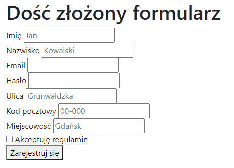
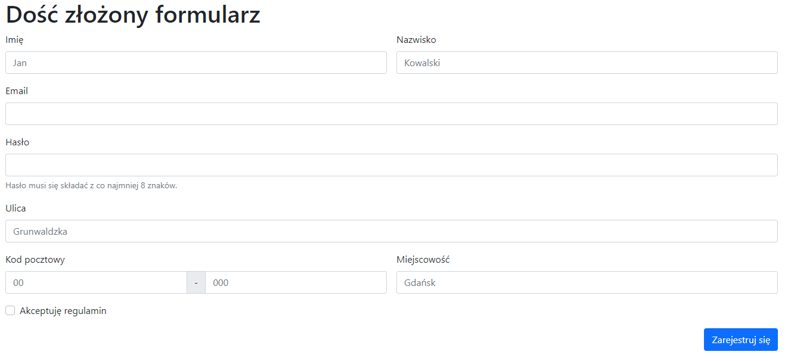
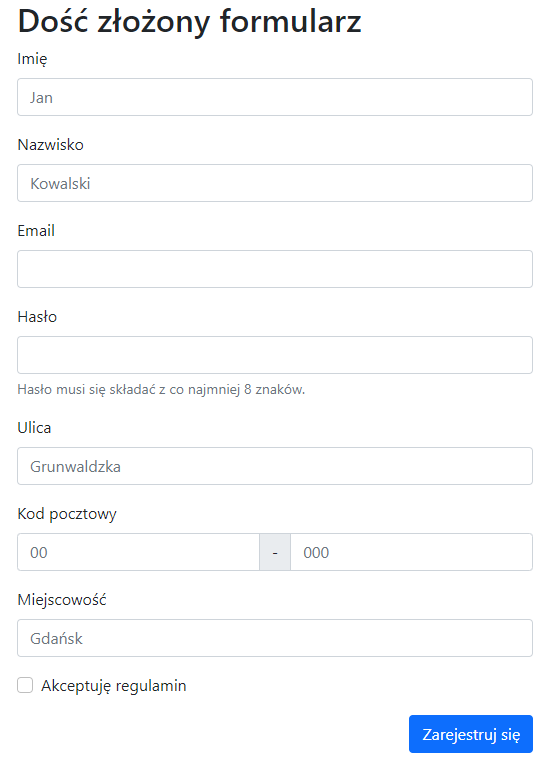
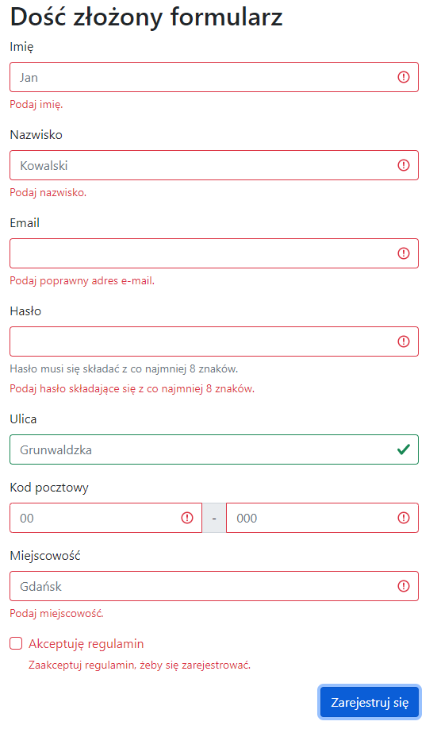
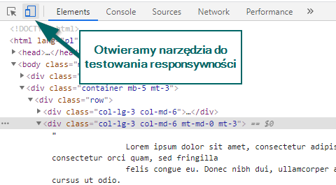
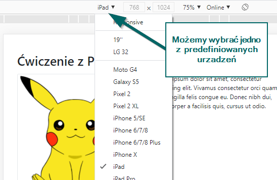
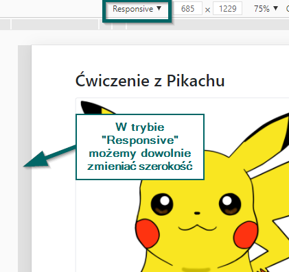

# Bootstrap – Ćwiczenie z formularzem

## Szablon

Przygotowałem szablon strony z dość rozbudowanym formularzem z danymi użytkownika. Zawiera już potrzebne skrypty
Bootstrap. Strona po otwarciu w przeglądarce wygląda mniej więcej tak:



Na końcu tego dokumentu znajduje się kod `html` pozwalający wygenerować to cudo. Wystarczy go wkleić do pustego pliku,
zapisać z rozszerzeniem `html` – np. `form.html` – i otworzyć w przeglądarce.

## Zadanie

Chciałbym, żeby powyższa strona wyglądała tak:

- Na co najmniej średnich urządzeniach (większych lub równych `md`) – np. _iPad_, laptop:

  

- tak na małych urządzeniach – np. _iPhone X_, _Moto G4_:

  

- dodatkowo powinna działać walidacja:

  

### Uwagi i podpowiedzi

- tym razem konieczne będzie dodanie kilku elementów (np. tych z komunikatami walidacyjnymi);
- jeżeli komuś tak będzie wygodniej, może usunąć mój formularz i zacząć pisać od zera;
- w większości `input`-ów trzeba dopisać
  odpowiedni [type](https://developer.mozilla.org/en-US/docs/Web/HTML/Element/input);
- dodałem już odpowiedni skrypt `javascript` pozwalający wykonywać walidacje;
- minimalną długość pola możemy ustalić używając wyłącznie `html`
  – [minlength](https://developer.mozilla.org/en-US/docs/Web/HTML/Attributes/minlength).

## Testowanie

Na przykładzie _Chrome_ (screeny pochodzą z zadania
dotyczącego [Pikachu](https://github.com/pawel-stan/bootstrap-excersise-pikachu)).

1. Otwieramy narzędzia deweloperskie (_Ctrl + Shift + I_).
1. Otwieramy narzędzia do testowania responsywności:

   

1. Następnie albo wybieramy z listy konkretne urządzenie:

   

1. Albo ustawiamy tryb _Responsive_ i dowolnie zmieniamy szerokość urządzenia:

   

Inne przeglądarki:

- Firefox ma analogiczny tryb – wystarczy użyć skrótu _Ctrl + Shit + M_;
- W Operze i w nowym Edge jest identycznie jak w Chrome (obie bazują na silniki Chromium);
- Internet Explorer 11 – nie; zresztą Bootstrap 5 już nie wspiera tej _przeglądarki_.

## Kod strony

```html
<!DOCTYPE html>
<html lang="pl">
  <head>
    <meta charset="utf-8" />
    <meta name="viewport" content="width=device-width, initial-scale=1" />

    <!-- Bootstrap CSS -->
    <link
      href="https://cdn.jsdelivr.net/npm/bootstrap@5.0.0-beta1/dist/css/bootstrap.min.css"
      rel="stylesheet"
      integrity="sha384-giJF6kkoqNQ00vy+HMDP7azOuL0xtbfIcaT9wjKHr8RbDVddVHyTfAAsrekwKmP1"
      crossorigin="anonymous"
    />

    <title>Formularz</title>
  </head>

  <body>
    <div class="container">
      <h1>Dość złożony formularz</h1>

      <form>
        <div>
          <label for="input-name"> Imię </label>

          <input id="input-name" placeholder="Jan" />
        </div>

        <div>
          <label for="input-surname"> Nazwisko </label>

          <input id="input-surname" placeholder="Kowalski" />
        </div>

        <div>
          <label for="input-email"> Email </label>

          <input type="email" id="input-email" />
        </div>

        <div>
          <label for="input-password"> Hasło </label>

          <input minlength="8" id="input-password" />
        </div>

        <div>
          <label for="input-address"> Ulica </label>

          <input id="input-address" placeholder="Grunwaldzka" />
        </div>

        <div>
          <label for="input-postal-code"> Kod pocztowy </label>

          <input id="input-postal-code" placeholder="00-000" />
        </div>

        <div>
          <label for="input-city"> Miejscowość </label>

          <input id="input-city" placeholder="Gdańsk" required />
        </div>

        <div>
          <div>
            <input type="checkbox" id="check-terms" />

            <label for="check-terms"> Akceptuję regulamin </label>
          </div>
        </div>

        <div>
          <button type="submit">Zarejestruj się</button>
        </div>
      </form>
    </div>

    <script
      src="https://cdn.jsdelivr.net/npm/bootstrap@5.0.0-beta1/dist/js/bootstrap.bundle.min.js"
      integrity="sha384-ygbV9kiqUc6oa4msXn9868pTtWMgiQaeYH7/t7LECLbyPA2x65Kgf80OJFdroafW"
      crossorigin="anonymous"
    ></script>

    <script>
      // Example starter JavaScript for disabling form submissions if there are invalid fields
      (function () {
        "use strict";

        // Fetch all the forms we want to apply custom Bootstrap validation styles to
        var forms = document.querySelectorAll(".needs-validation");

        // Loop over them and prevent submission
        Array.prototype.slice.call(forms).forEach(function (form) {
          form.addEventListener(
            "submit",
            function (event) {
              event.preventDefault();
              event.stopPropagation();

              if (form.checkValidity()) {
                alert("Gratulacje – ten formularz wygląda dobrze :)");
              }

              form.classList.add("was-validated");
            },
            false
          );
        });
      })();
    </script>
  </body>
</html>
```

Strona jest też dostępna w pliku [advanced-form.html](advanced-form.html).
