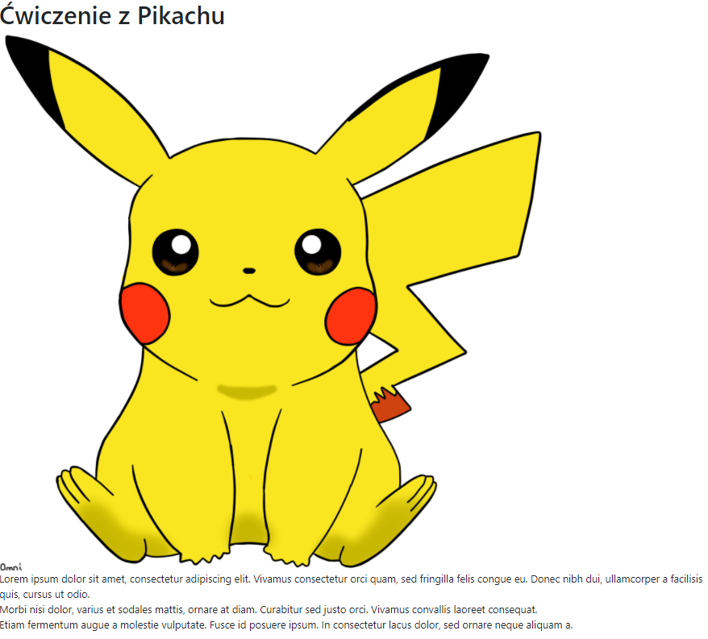
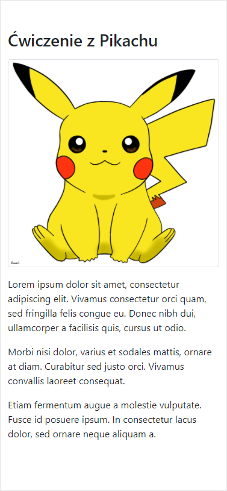
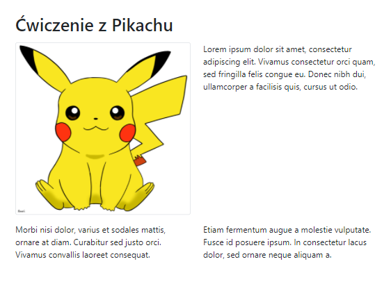

# Bootstrap – Ćwiczenie z Pikachu

## Szablon

Przygotowałem szablon strony ze zdjęciem Pikachu i tekstem zawartym w trzech `div`-ach. Zawiera już potrzebne skrypty
Bootstrap. Strona po otwarciu w przeglądarce wygląda mniej więcej tak:



Na końcu tego dokumentu znajduje się kod `html` pozwalający wygenerować to cudo. Wystarczy go wkleić do pustego pliku,
zapisać z rozszerzeniem `html` – np. `pikachu.html` – i otworzyć w przeglądarce.

## Zadanie

Chciałbym, żeby powyższa strona wyglądała tak:

- Na małych urządzeniach (mniejszych niż `md`) – np. _iPhone X_, _Moto G4_:

  

- Na średnich urządzeniach (`md`) – np. _iPad_:

  

- Na dużych urządzeniach – np. w przeglądarce laptopa;

  

### Uwagi

- Powyższy efekt można uzyskać **wyłącznie** dodając klasy bootstrapowe – `container`, `row` itp.;
- Nie trzeba dodawać żadnych dodatkowych elementów jak `div`, `span` itp.;
- Zwróćmy uwagę na marginesy:
  - jest dość spory margines na samej górze strony;
  - na małych urządzeniach mamy margines nad każdą sekcją tekstu (_Lorem ipsum..._, _Morbi nisi..._, _Etiam
    fermentum..._);
  - na średnich urządzeniach mamy margines tylko nad dwiema dolnymi sekcjami tekstu (_Morbi nisi..._, _Etiam
    fermentum..._).
- Kilka uwag co do obrazka:
  - we wszystkich przypadkach dopasowuje swoją szerokość do `div`-u, w którym się znajduje;
  - otacza go ramka.
- Dokładna wysokość marginesów nie jest określona, bo też nie jest istotna – w pracy zwykle też nie dostajemy podanych
  dokładnych wartości w pikselach.

## Testowanie

Na przykładzie _Chrome_.

1. Otwieramy narzędzia deweloperskie (_Ctrl + Shift + I_).
1. Otwieramy narzędzia do testowania responsywności:

   

1. Następnie albo wybieramy z listy konkretne urządzenie:

   

1. Albo ustawiamy tryb _Responsive_ i dowolnie zmieniamy szerokość urządzenia:

   

Inne przeglądarki:

- Firefox ma analogiczny tryb – wystarczy użyć skrótu _Ctrl + Shit + M_;
- W Operze i w nowym Edge jest identycznie jak w Chrome (obie bazują na silniki Chromium);
- Internet Explorer 11 – nie; zresztą Bootstrap 5 już nie wspiera tej _przeglądarki_.

## Kod strony

```html
<!DOCTYPE html>
<html lang="pl">
  <head>
    <meta charset="utf-8" />
    <meta name="viewport" content="width=device-width, initial-scale=1" />

    <!-- Bootstrap CSS -->
    <link
      href="https://cdn.jsdelivr.net/npm/bootstrap@5.0.0-beta1/dist/css/bootstrap.min.css"
      rel="stylesheet"
      integrity="sha384-giJF6kkoqNQ00vy+HMDP7azOuL0xtbfIcaT9wjKHr8RbDVddVHyTfAAsrekwKmP1"
      crossorigin="anonymous"
    />

    <title>Pikachu</title>
  </head>

  <body>
    <div>
      <h1>Ćwiczenie z Pikachu</h1>
    </div>

    <div>
      <div>
        <div>
          
        </div>
        <div>
          Lorem ipsum dolor sit amet, consectetur adipiscing elit. Vivamus consectetur orci quam, sed fringilla felis
          congue eu. Donec nibh dui, ullamcorper a facilisis quis, cursus ut odio.
        </div>
        <div>
          Morbi nisi dolor, varius et sodales mattis, ornare at diam. Curabitur sed justo orci. Vivamus convallis
          laoreet consequat. Etiam fermentum augue a molestie vulputate. Fusce id posuere ipsum. In consectetur lacus
          dolor, sed ornare neque aliquam a.
        </div>
        <div>
          Donec quis leo eu erat placerat ornare. In erat orci, porttitor vel justo non, convallis vehicula lectus.
          Nullam in ullamcorper quam. Suspendisse a quam mattis, egestas nibh ut, convallis augue.
        </div>
      </div>
    </div>

    <script
      src="https://cdn.jsdelivr.net/npm/bootstrap@5.0.0-beta1/dist/js/bootstrap.bundle.min.js"
      integrity="sha384-ygbV9kiqUc6oa4msXn9868pTtWMgiQaeYH7/t7LECLbyPA2x65Kgf80OJFdroafW"
      crossorigin="anonymous"
    ></script>
  </body>
</html>
```

Strona jest też dostępna w pliku [pikachu.html](pikachu.html).

## Informacje dodatkowe

Źródło obrazka: <https://pixy.org/1088380/>
