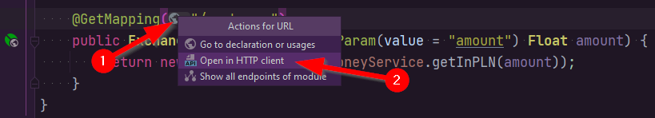

# JUnit — Spring Boot + Mockito

## Projekt

Na stronie <https://github.com/pawel-stan/junit-spring-boot-demo> udostępniłem projekt zawierający aplikację [Spring Boot](https://spring.io/projects/spring-boot) wraz z testami jednostkowymi wykorzystującymi [Mockito](https://site.mockito.org/).

Nasza aplikacja umożliwia obecnie przeliczenie na złotówki stawki podanej w dolarach. Możemy to zrobić za pomocą akcji [REST](https://en.wikipedia.org/wiki/Representational_state_transfer)-owej `/exchange/`, która zwraca `JSON` zawierający odpowiednią kwotę:

```java
GET http://localhost:8080/exchange?amount=3.5
{
  "initialAmount": 3.5,
  "amountWithRate": 13.03925
}
```

## Zadanie

Dodaj możliwość przeliczania stawek w różnych walutach. Po zmianach powinniśmy móc wykonać poniższe zapytanie, by uzyskać stawkę w wybranej walucie (tu we frankach szwajcarskich):

```java
GET http://localhost:8080/exchange?amount=3.5&currency=CHF
{
  "initialAmount": 3.5,
  "amountWithRate": 16.12814
}
```

W tym celu konieczne będzie dodanie do akcji `/exchange` nowego parametru (ja nazwałem go `currency`) oraz rozszerzenie metod `ExchangeController#exchange`, `MoneyService#getInPLN` itd. Oczywiście będziemy musieli dopisać też kolejne testy jednostkowe.

### Co powinny sprawdzać nowe testy jednostkowe?

Obecnie test `returns_amount_in_pln` (w `MoneyServiceTest`) _mockuje_ działanie metody `CurrencyService#getRate` — sprawia, że zwraca ona (w trakcie wykonywania testu) zawsze tę samą wartość, niezależnie od argumentu, oraz że nie łączy się ona z serwisem NBP. Nowe testy powinny też sprawdzić działanie tej metody dla różnych walut (`currency`), np.:

```java
// import static org.mockito.Mockito.lenient;
lenient().when(currencyService.getRate("USD")).thenReturn(1.5f);
lenient().when(currencyService.getRate("EUR")).thenReturn(3f);
```

Dodanie `lenient()` jest tu [konieczne](https://stackoverflow.com/a/52156652/2224598), żeby uniknąć błędów kompilacji.

### TDD — dla chętnych

Jeśli będziecie mieli ochotę, spróbujcie wykonać to zadanie stosując technikę [TDD](https://en.wikipedia.org/wiki/Test-driven_development) — Test Driven Development — czyli najpierw zacznijcie pisać testy, następnie wprowadźcie zmiany w kodzie. Tego nie będę dodatkowo oceniał — ale jest to ciekawe ćwiczenie, które może się kiedyś przydać w pracy.

## Jak testować REST w IntelliJ

Przejdź do odpowiedniej klasy (u nas `ExchangeController`) a następnie:

1. Kliknij ikonę globusa nad wybraną akcją (np. `exchange()`).
1. Wybierz opcję _Open in HTTP client_.

   

## Jak uruchomić testy w IntelliJ

Po pobraniu projektu z github możemy łatwo uruchomić testy w IntelliJ. Wystarczy przejść do klasy z testami (u nas `StringUtilsTest`) i wykorzystać ikonkę ze strzałkami:


Uwaga: Do wykonania tego zadania potrzebne będzie [IntelliJ Ultimate](https://www.jetbrains.com/idea/download) (czyli **płatne**).
