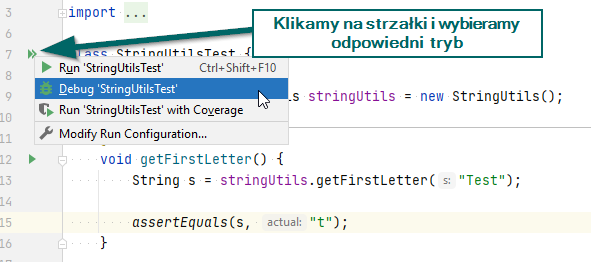

# JUnit — proste testy w czystej Javie

## Projekt

Na stronie <https://github.com/pawel-stan/junit-sample-project> udostępniłem projekt zawierający jedną klasę prostą metodę znajdującą pierwszą literę podanego argumentu (`StringUtils#getFirstLetter(String s)`) oraz kilka testów jednostkowych w [JUnit 5](https://junit.org/junit5/docs/current/user-guide) — w klasie `StringUtilsTest`.

## Zadanie

1. Dodaj do klasy `StringUtils` metodę `getLastLetter(String s)`, która zwróci ostatnią literę podanego w argumencie słowa, a jeżeli w argumencie podamy `null` lub `""`, metoda powinna zwrócić `""`; na przykład:
   - `getLastLetter("JUnit")` --> `"t"`
   - `getLastLetter("Studia podyplomowe")` --> `"e"`
   - `getLastLetter("")` --> `""`
   - `getLastLetter(null)` --> `""`
1. Dodaj do klasy `StringUtilsTest` testy sprawdzające:
   - czy metoda zadziała dla _poprawnych_ argumentów, np. dla argumentu `"Java"` zwróci `"a"`,
   - czy metoda dla argumentów `null` oraz `""` zwróci pusty ciąg znaków, czyli `""`.
1. Uruchom wszystkie testy znajdujące się w `StringUtilsTest`.

## Jak uruchomić testy w IntelliJ

Po pobraniu projektu z github możemy łatwo uruchomić testy w IntelliJ. Wystarczy przejść do klasy z testami (u nas `StringUtilsTest`) i wykorzystać ikonkę ze strzałkami:

Uwaga: Do wykonania tego zadania wystarczy [IntelliJ Community](https://www.jetbrains.com/idea/download) (czyli darmowy).
